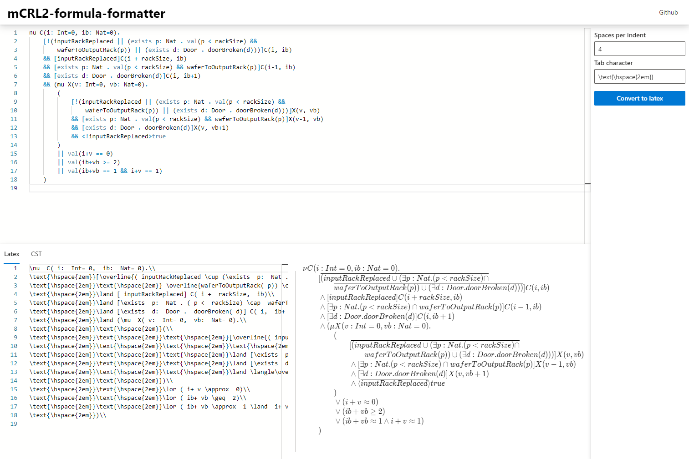

# mCRL2-formatter

This repository contains a node package for converting [mCRL2](https://www.mcrl2.org/web/user_manual/index.html) [mu calculus formulas](https://www.mcrl2.org/web/user_manual/language_reference/mucalc.html?highlight=calculus) to equivalent formulas in latex form.

I initially intended to also create a formatter/pretty printer, but this turned out to generally be a more complex problem than anticipated. Doing this right would require a lot of time, which I didn't want to invest into it. So for now only plain text to latex conversion is included.

The most important parts of the code are:

-   The parser: [muCalculusParser](https://github.com/TarVK/mCRL2-formatter/blob/main/src/parser/muCalculusParser.ts)
-   The CST to latex converter: [nodeToLatex](https://github.com/TarVK/mCRL2-formatter/blob/main/src/formatting/nodeToLatex.ts)

## Website

This repository also contains a demo website from which the tool can be used without installing anything. This page can be found at: [tarvk.github.io/mCRL2-formatter/demo/build/](https://tarvk.github.io/mCRL2-formatter/demo/build/)

